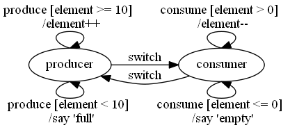

# Finite State Machine for JS
## Design
This project is an implementation of the **Finite State Machine** (FSM) implementation in JS.

This library was inspired of [Akka FSM][akka-fsm] which was already inspired of the [Erlang design principles][erlang-fsm].

> A FSM can be described as a set of relations of the form:

> `State(S) x Event(E) -> Actions (A), State(S')`

> These relations are interpreted as meaning:

> _If we are in state `S` and the event `E` occurs, we should perform the actions `A` and make a transition to the state `S'`._

> **-- [Erlang design principles][erlang-fsm]**

## fsm-js
This library is an implementation of the FSM design. It helps you to structure your code.

You can import it with bower:

```
bower install fms-js --save
```

## Tutorial: How to construct your FSM in 10 steps
This part explains you main steps to create a FSM with this library. So it assumes that you already have your diagram created. There is a few examples in `/samples` directory if you want to see how to construct them.

### Step 1: Write you FSM
First of all, you should construct your machine in a paper or with a spacialized tool. This will help you construct your code and communicate with your team.

In this project, we will use [Graphviz][graphviz], which respect the mathematical representation of FSM (see [Deterministic finite automaton (Wikipedia)][wiki-dfa]). This tool can be difficult to masterize. You can use any other tool or representation as UML (see [State Machine Diagram][uml-smd]).

In this example, we will implement the FSM below. Be aware that it is not the [Producer–consumer problem][producer–consumer-problem]!



### Step 2: Create your HTML file
Your diagram is done, so you need to implement it. You can create a new HTML file and import the library in it.

```html
<!doctype html>
<html>
  <head>
    <meta charset="utf-8" />
    <title>My first FSM!</title>
  </head>
  <body>
    <script src="bower_components/fsm-js/lib/fsm.min.js"></script>
    <script>
      // Your code here
    </script>
  </body>
</html>
```

### Step 3: Create your FSM nodes
Now, you can construct nodes of your FSM as below.

```js
var fsm = k.fsm.create(function(fsm) {
  fsm.when('producer', function(state) {
    // "producer" state initializer
  })

  fsm.when('consumer', function(state) {
    // "consumer" state initializer
  })
})
```

### Step 4: Create your events
Once your nodes are created, you can add your event list for each node.

### Step 4.1: producer

```js
fsm.when('producer', function(state) {
  state.on('produce', function(data){
    // Your logic on 'produce' event when 'producer' state
  })
  state.on('switch', function(data){
    // Your logic on 'switch' event when 'producer' state
  })
})
```

### Step 4.2: consumer

```js
fsm.when('consumer', function(state) {
  state.on('consume', function(data){
    // Your logic on 'consume' event when 'consumer' state
  })
  state.on('switch', function(data){
    // Your logic on 'produce' event when 'consumer' state
  })
})
```

### Before step 5: philosophy of conditions and actions
With this library, the philosophie of actions is to do operations, then return the next state and data of the FSM. So you will return an array with the state name as first element and the data as second element.

Current FSM data will always be passed as first argument of the event handler, even though the data is `null`. The type of the current FSM data is free and dynamic.

For instance, if you are in state `S1`, with data `D1` and you want to go to state `S2` with data `D2` on event `E1`, then you will return `[S2, D2]`. Full code below:

```js
fsm.when('S1', function(s1){
  s1.on('E1', function(d1){
    // operations, d2 = xxx
    return ['S2', d2]
  })
})
```

Be aware that it is not a good practice to have your data in another location than in current FSM state. However, there is a way to do so if needed, see _Step 6: Externalize actions_ for more information.

In case of having conditions for the same event (as in this tutorial example), you treated them into the event handler.

For instance, if you are in state `S1`, with data `D1`. On event `E1`, if `C1` is true, then you want to go on state `S2` with data `D2`, else you want to go to state `S3` with data `D3`. The code will be as below:

```js
fsm.when('S1', function(s1){
  s1.on('E1', function(d1){
    if (c1) {
      // operations, d2 = xxx
      return ['S2', d2]
    } else {
      // operations, d3 = xxx
      return ['S3', d3]
    }
  })
})
```

### Step 5: Implement actions of events
The translation of the diagram with the philosophy explained in previous step give the following codes.

In this example, `data` will represent the number of produced and non-consumed elements.

### Step 5.1: producer - produce

```js
// state = producer
state.on('produce', function(data){
  if (data < 10) {
    return ['producer', data + 1]
  } else {
    console.log('full')
    return ['producer', data]
  }
})
```

### Step 5.2: producer - switch

```js
// state = producer
state.on('switch', function(data){
  return ['consumer', data]
})
```

### Step 5.3: consumer - consume

```js
// state = consumer
state.on('consume', function(data){
  if (data > 0) {
    return ['consumer', data - 1]
  } else {
    console.log('empty')
    return ['consumer', data]
  }
})
```

### Step 5.4: consumer - switch

```js
// state = consumer
state.on('switch', function(data){
  return ['producer', data]
})
```

### Step 6: Externalize actions
This tutorial does not show you a difficult FSM, but when your FSM grows, you should externalize your action, as well as to refactor them.

When building the FSM, you can add method to it as below.

```js
var fsm = k.fsm.create(function(fsm) {
  // fsm.when(...)

  fsm.say = function(text) {
    console.log(text)
  }
})
```

Then, in your event handlers, you call them as below directly with `this`.

```js
// state = producer
// Same for consumer.consume.
state.on('produce', function(data){
  if (data < 10) {
    return ['producer', data + 1]
  } else {
    this.say('full')
    return ['producer', data]
  }
})
```

It is also possible to add attribute the same way we add functions, althought, it is a bad practice.

### Step 8: Add parameters to events
In this example, we want to precise how many elements we want to add or remove when firing event `produce` or `consume`.

So, the code will be change as below.

```js
state.on('produce', function(data, elements){
  var elts = elements || 1
  if (data + elts <= 10) {
    return ['producer', data + elts]
  } else {
    this.say('full')
    return ['producer', data]
  }
})
```

```js
state.on('consume', function(data, elements){
  var elts = elements || 1
  if (data - elts >= 0) {
    return ['consumer', data - elts]
  } else {
    this.say('empty')
    return ['consumer', data]
  }
})
```

### Step 9: Set initial state
We built our FSM logic, but which is the first state and data of the FSM? You set it yourself by calling `startWith` on FSM builder.

```js
var fsm = k.fsm.create(function(fsm) {
  fsm.startWith('producer', 0)

  // other
})
```

This method can be called any time any number of times during FSM creation.

### Step 10: fire events
Finally, we can use our fsm to fire event and execute our logic.

```js
var fsm = k.fsm.create(function(fsm) {
  // Creation
})

// (state, data)
// (producer, 0)
fsm.fire('produce')
// (producer, 1)
fsm.fire('produce', 2)
// (producer, 3)

fsm.fire('consume') // exception to handle

// (producer, 3)
fsm.fire('switch')
// (consumer, 3)
fsm.fire('consume')
// (consumer, 2)
fsm.fire('consume', 3) // empty
// (consumer, 2)
fsm.fire('switch')
// (producer, 2)
fsm.fire('produce', 10) // full
// (producer, 2)
```

Be aware that your FSM is sealed. So, you cannot add or remove functions and attributes after the end of `create` function. However, you always can change the values of these functions or attributes.

### Listen on state change
If you want to listen on state changes, you can add a listener with `fsm.onStateChanged`. See full code of this tutorial for an example of use.

### Full code
You can see full code in `samples/tutorial/tutorial.html`.

## Limitations
This library does not provide any support for UI interactions (listeners or DOM modifiers). They need to be handled manually, as shown in `samples/tutorial/tutorial.html`. This choice is that you can import this library for any of your projets, without using another library or framework.

This library does not correct your UI, but gives you a way to avoid unwanted operations.

## Example of use
There a few ideas of example of use:
- All workflow systems (an example for document workflow will be available soon)
- Processes (eg: file upload = choose file > sending > image sent ; cannot upload two files at the same time)
- UI management
- client - server synchronization: with solutions as Akka, you can synchronize your client and server more efficiently

A lot of applications need a behavior as a FSM, but few of them use this design and some bugs appear quickly.

## Samples
- [Tutorial - Full code](samples/tutorial/tutorial.html)
- [Lift](samples/lift/lift.html)

If you use this library, please contact me to tell your (non-)satisfaction to improve this library. If you want, I can also cite you in this page. ;)

## Troubleshooting
If you encounter any bug, please create a new issue on Github project.

If you have any suggestion, please create a new issue on Github project or contact me.

## History
### 0.1.0 - 25/12/2015
- Creation of the library

## FAQ

### Why should I use this design?

This design provides you a way to perform operation if and only if you are in a certain state.
It will avoid you to check each time what the user can do or not.
In a server side, it can be used to check user actions on an element (eg. a document cannot be updated if it is in a validation state, it can only be send to draft or be validated)

This design, with a diagram, explains what the user can do and when.

### Everything can be written with this design?

Of course not!

This design is valid for a lot of applications, but not all of them.
For instance, a website navigation should not be done with a FSM, but with existing technology instead.

### Should I use your implementation of FSM?

Of course not!

This implementation is my vision of the FSM, inspired of [Akka][akka-fsm].
You can develop your own implementation or search others on the web.
A few of them already exist in Github:

* https://github.com/fschaefer/Stately.js
* https://github.com/ichernev/node-state

This implementation used another approach to develop them, but I do not claim be the best. :)

But if you prefer this approach or another, I am open to discuss this with you.

## External links
- [Akka - FSM][akka-fsm]
- [Erlang Design Principles - FSM][erlang-fsm]
- [Graphviz][graphviz]
- [Wikipedia - Finite-state machine][wiki-fsm]
- [Wikipedia - Deterministic finite automaton][wiki-dfa]
- [UML - State Machine Diagram][uml-smd]

[akka-fsm]: http://doc.akka.io/docs/akka/2.4.1/scala/fsm.html
[erlang-fsm]: http://www.erlang.org/documentation/doc-4.8.2/doc/design_principles/fsm.html
[graphviz]: Graphviz
[wiki-fsm]: https://en.wikipedia.org/wiki/Finite-state_machine
[wiki-dfa]: https://en.wikipedia.org/wiki/Deterministic_finite_automaton
[uml-smd]: http://creately.com/blog/diagrams/uml-diagram-types-examples/#StateMachDiagram
[producer–consumer-problem]: https://en.wikipedia.org/wiki/Producer%E2%80%93consumer_problem
